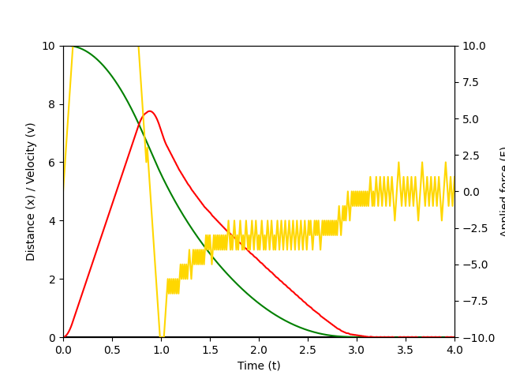

# QActor

A Python implementation of the reactive executor for qualitative plans, as described in the PhD Thesis:

D. Šoberl: Automated planning with induced qualitative models in dynamic robotic domains, 2021

Available at:

https://repozitorij.uni-lj.si/IzpisGradiva.php?id=126285

Two examples are provided.

### Example 1: The accelerated cart

This is a replication of the performance assessment test described in Section 5.6.2 of the PhD thesis. A cart is initially placed at x = -10 m from the goal position x = 0. A force -10 <= F <= 10 is applied to the cart at 100 Hz action frequency. The executor determines a critical point at which the cart starts decelerating so that the goal position is reached at zero velocity. With subsequent runs, the result is improved.

### Example 2: Lunar Lander stabilization

A qualitative model is used to stabilize the Lunar Lander (A [Gymnasium](https://gymnasium.farama.org/) environment) in mid-air. By dynamically adjusting the target speeds, the Lunar Lander can also be landed safely.

### TODO

Numerical constraints of type

- x > x1, x < x1,
- x0 < x < x1

still have to be implemented. Those can be used to avoid fail states (collisions, grip loss, etc.).